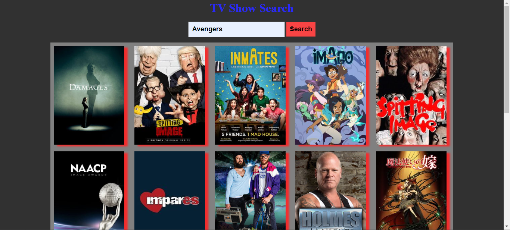

### By Akshun Verma

## Project Name: TV Show Name

- In this project I have made a TV Show by using Html, CSS, JS and API calls. When we search any show or any movie it will give us the pic related to that show/movie. 

### Author and Contact
- Akshun Verma
   - 
   - 

#### Honest time to finish the project !
 - I had taken around 1.5 hours to finish this project.

### Link of the website
- [Please Click Here](https://tv-show-aivy45.netlify.app/)

- 

 ### Feedback
 - If you have any feedback, please reach out to me at akshunverma45@gmail.com
